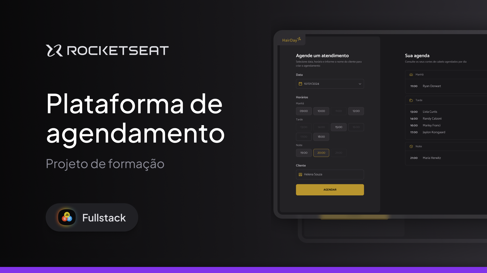

# 
  
 #

 Este app foi feito em conjunto com o professor Rodrigo Gonçalves do módulo Javascript antes do framework da rocketseat
 
 

  [Projeto](#-projeto) &nbsp; | &nbsp; [Aprendizado](#-aprendizado) &nbsp; | &nbsp; [Tecnologias](#-tecnologias) &nbsp;
  

  

 
 
 

## 🚀 PROJETO
 O *Hairday* é um aplicativo de agendamento para cortes de cabelo, através dele será possivel você agendar seus clientes interessados.

## 📚 APRENDIZADO
Neste projeto coloquei em práticas os conhecimentos de webpack, API's para guardar dados, bundlers para compatibilidade e um pouco mais sobre funções assíncronas, libs e node.js.

## 💻 TECNOLOGIAS
Neste projeto foi utilizado:

- Javascript (para inteligência do site);
- Bundlers (para compatibilidade);
- Webpack (para empacotamento);
- Node.js;
- Api's (day.js e webpack serve);